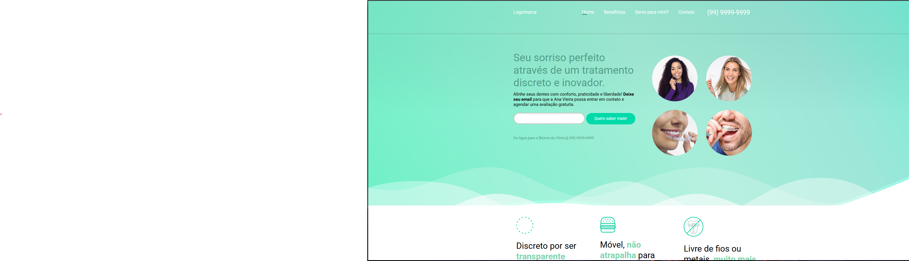

# 🦷 Consultório Odontológico

Site institucional desenvolvido para um consultório odontológico, com o objetivo de apresentar os serviços, profissionais, localização e informações de contato de forma clara e acessível.
---

## 🖥️ Tecnologias utilizadas:
- ✔️ HTML5
- ✔️ CSS3
- ✔️ JavaQuery
- ✔️ FontAwesome
---

## 📄 Funcionalidades

- Página inicial com apresentação do consultório
- Seção de serviços odontológicos
- Informações de contato e localização
- Formulário de contato

## 📸 Preview do projeto:
 

---

## 📂 Funcionalidades:
- 🔸 Design responsivo (mobile, tablet e desktop)
- 🔸 Layout moderno e clean
- 🔸 Seções para apresentação de serviços, sobre, contato e mais
- 🔸 Navegação simples e intuitiva

---

## ⚙️ Como visualizar este projeto:
1. Acesse https://devpedrohenrique25.github.io/Consultorio-Dentista/
   ou
3. Clique no botão verde **"Code"** acima.
4. Selecione **"Download ZIP"** para baixar o projeto.
